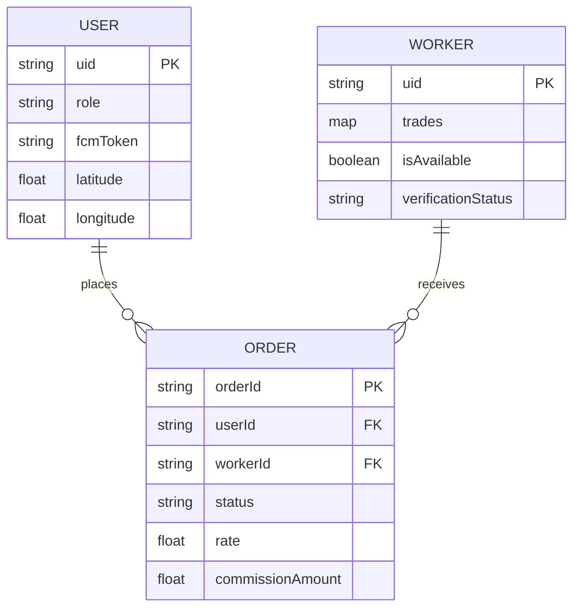

# Database Schema - Firebase Realtime Database

DIP Services uses a NoSQL hierarchical structure in Firebase Realtime Database.

## 📂 Root Structure

### `users/{uid}`
Stores core profile information for all users.
- `name`: String
- `phone`: String
- `role`: 'user' | 'worker' | 'admin'
- `city`: String
- `latitude`/`longitude`: Numbers
- `fcmToken`: String (Push notification target)

### `workers/{uid}`
Stores professional details for service providers.
- `trades`: Map of trade objects (e.g., `Plumber`, `Electrician`)
  - `experience`: String
  - `rates`: Object (Visit, Half Day, Full Day)
  - `rating`: Number
- `isAvailable`: Boolean
- `totalJobs`: Number
- `verificationStatus`: 'pending' | 'approved' | 'rejected'

### `orders/{orderId}`
Stores booking transactions.
- `userId`/`workerId`: Foreign keys to users/workers.
- `status`: 'pending' | 'accepted' | 'completed' | 'rejected'
- `rate`: Number
- `commissionAmount`: Number
- `timestamp`: ISO String

### `outdoor_profiles/{uid}`
Specific configurations for transport and rental services (Auto, JCB, Marriage Hall).

## 📊 ER Diagram (Mermaid)

## ⚡ Performance Considerations
- **Indexing**: `orders` are indexed by `userId` and `workerId` for fast history retrieval.
- **Denormalization**: Worker names and phones are duplicated in `orders` to avoid multiple lookups during list rendering.