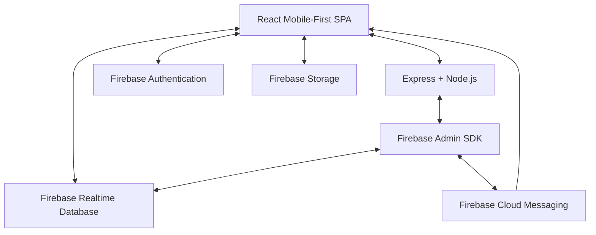

# System Architecture - DIP Services

The DIP Services platform follows a **Client-Server Architecture** with a heavy reliance on **Firebase** for real-time capabilities and **Capacitor** for cross-platform mobile delivery.

## High-Level Overview

## Core Components

### 1. Frontend (Mobile-First SPA)
- **Framework**: React 19 with TypeScript.
- **Styling**: Tailwind CSS v4 for responsive, utility-first design.
- **Routing**: React Router DOM 7 for role-guarded navigation.
- **State**: Context API (`AuthContext`, `LanguageContext`) for global state.

### 2. Backend (Notification & Management Server)
- **Environment**: Node.js with Express.
- **Runtime**: `tsx` for direct TypeScript execution.
- **Responsibility**: 
  - Serving the SPA and static assets.
  - Proxying/Serving the Service Worker (`firebase-messaging-sw.js`).
  - Handling targeted and broadcast push notifications via Firebase Admin SDK.
  - Database monitoring for automated job alerts.

### 3. Data & Auth Layer (Firebase)
- **Authentication**: Email/Password based auth with role metadata stored in DB.
- **Realtime Database**: Hierarchical JSON store for Users, Workers, Orders, and Geo-coordinates.
- **Storage**: Binary storage for profile pictures and service images.

## Workflows

### Booking Workflow
1. **Discovery**: Customer browses categories or searches for workers.
2. **Radius Validation**: App calculates distance between Customer's location and Worker's location using the **Haversine Formula**.
3. **Request**: Customer submits a booking request (Order).
4. **Notification**: Server detects new order or receives an `/api/notify` call and sends FCM push to the worker.
5. **Acceptance**: Worker accepts/declines. If accepted, customer is notified and WhatsApp communication is facilitated.

### Location Matching (25km Radius)
- Every worker's location is stored as `latitude` and `longitude`.
- When a customer attempts to book, the system fetches the worker's coordinates.
- The `getDistance` utility calculates the air distance.
- If `distance > 25km`, the booking button is disabled or a warning is shown (Requirement).

### Authentication Flow
1. User logs in via Firebase Client SDK.
2. `AuthContext` retrieves the user profile from `users/{uid}`.
3. If the user is a worker, additional data is fetched from `workers/{uid}`.
4. FCM token is refreshed and stored in the database for both `users` and `workers` nodes.