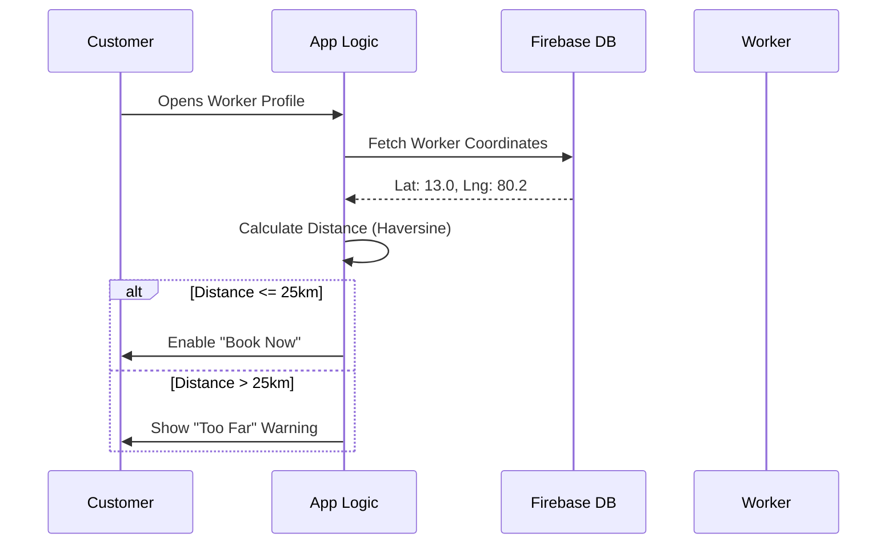

# User Flow - DIP Services

This document outlines the step-by-step journeys for different user roles within the application.

## 1. Customer Flow

### Registration & Onboarding
1. **Sign Up**: Email, password, name, and phone number.
2. **Location**: Customer selects their city and precise location via Map/POI search.
3. **Dashboard**: Access to service categories (Plumber, Electrician, etc.).

### Booking Process
1. **Search**: Filter workers by category, city, or name.
2. **Selection**: View worker profile, experience, ratings, and rates.
3. **Radius Check**: System verifies if the worker is within **25km**.
4. **Booking**: Fill in issue description, preferred time, and confirm.
5. **Tracking**: View order status in "Order History".

## 2. Service Provider (Worker) Flow

### Registration & Setup
1. **Sign Up**: Select "Worker" role during registration.
2. **Profile Setup**: 
   - Select trades (multiple trades supported).
   - Set rates (Quick Visit, Half Day, Full Day).
   - Add bio and experience.
3. **Availability**: Toggle "Available" status to appear in customer searches.

### Job Management
1. **Notification**: Receive push notification for new job requests.
2. **Review**: Check job details, location, and offered amount.
3. **Action**: Accept or Decline.
4. **Execution**: Perform service and mark as "Completed" in the app.
5. **Earnings**: View earnings and pay platform commission via UPI.

## 3. Location-Based Filtering Logic

## 4. Payment & Commission Flow
1. **Job Completion**: Worker marks job as done.
2. **Commission Calc**: System calculates platform fee (e.g., 3% for trades, 10% for transport).
3. **Payment**: Worker pays via UPI and submits screenshot/reference.
4. **Admin Verification**: Admin verifies payment in the dashboard.