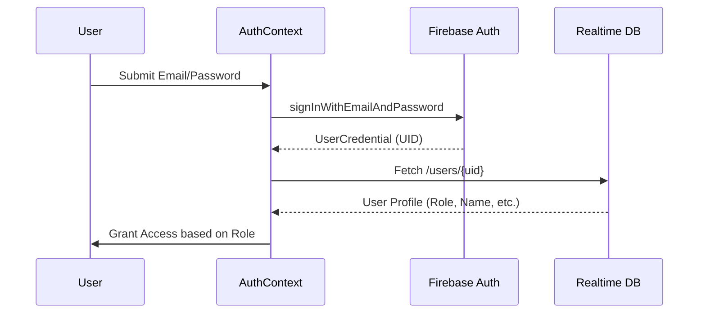

# Authentication System - DIP Services

DIP Services uses **Firebase Authentication** for secure user management and **Firebase Realtime Database** for role-based metadata.

## 🔑 Authentication Flow



## 🛡️ Role-Based Access Control (RBAC)

The application supports three roles, each with its own dashboard and navigation:

| Role | Permissions | Dashboard |
|---|---|---|
| `user` | Browse workers, place bookings, view own orders. | `UserDashboard` |
| `worker` | Manage trades, accept/decline jobs, view earnings. | `WorkerDashboard` |
| `admin` | Verify workers, confirm payments, send broadcasts. | `AdminDashboard` |

### Route Protection
The `AuthGuard` component handles route protection:
```tsx
<Route element={<AuthGuard allowedRoles={['worker']} />}>
  <Route path="/worker" element={<WorkerDashboard />} />
</Route>
```

## 📱 Session Management
- **Persistence**: Firebase handles session persistence automatically.
- **Profile Sync**: `AuthContext` provides a `refreshProfile` function to sync local state with database updates.
- **FCM Token Sync**: Upon login, the app refreshes the FCM token and saves it to the user's profile for push notifications.

## 🔐 Security Measures
- **Password Hashing**: Managed by Firebase (Argon2/Bcrypt internally).
- **Protected Database Nodes**: Database rules ensure users can only write to their own nodes.
- **Role Verification**: Roles are stored in the database and cannot be changed by the user via the frontend once set (except through admin actions).
